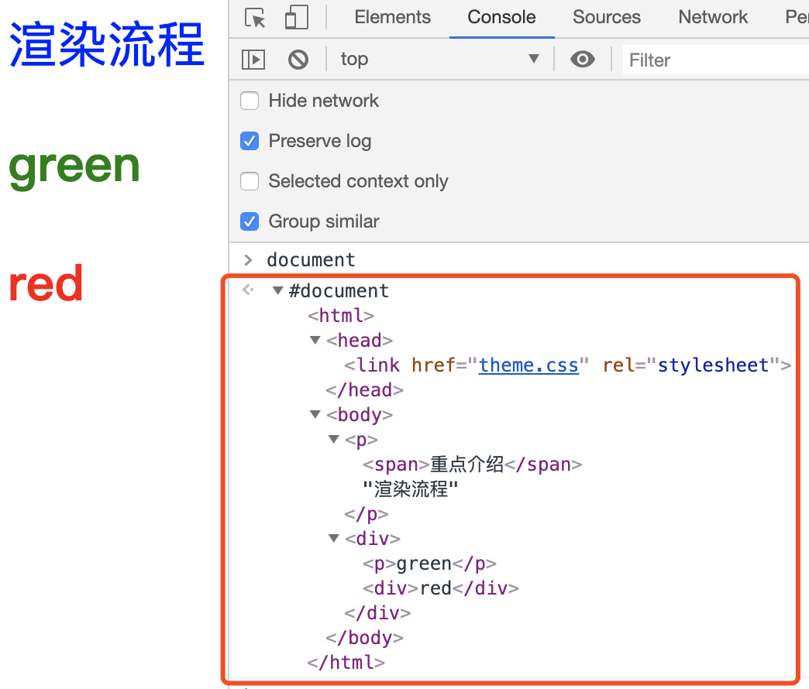
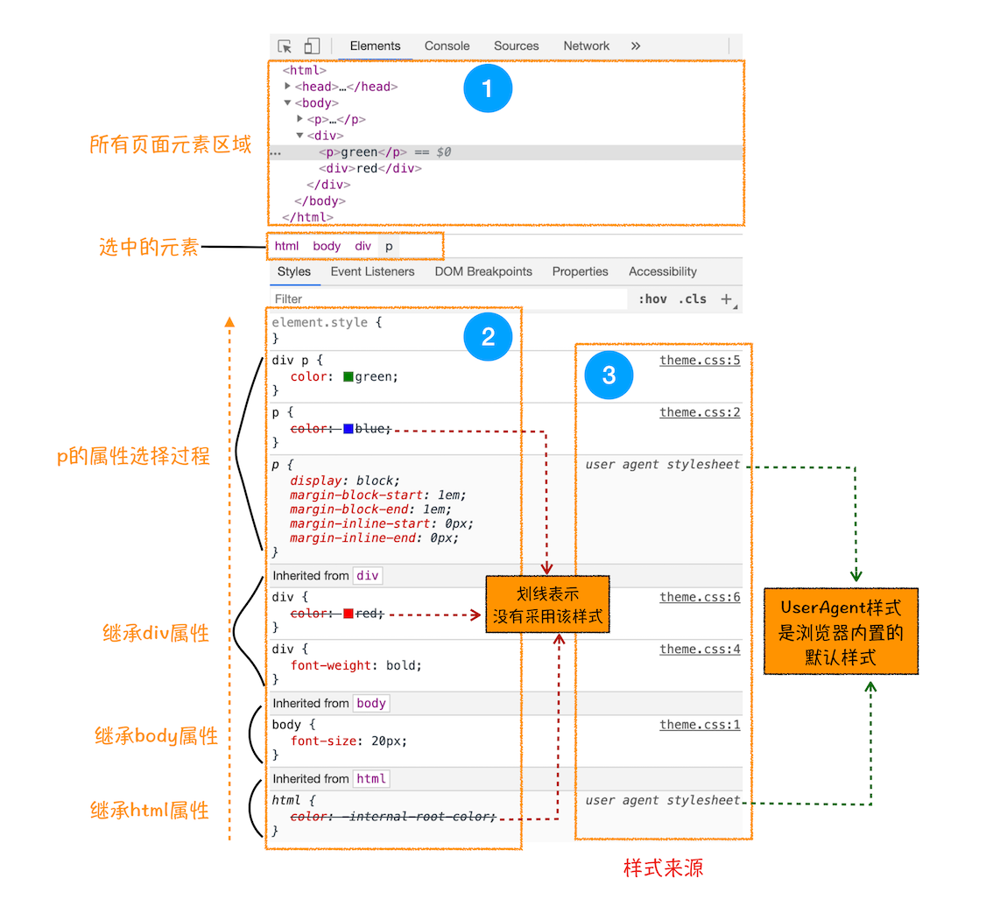

# 从浏览器渲染流程中窥视页面性能优化

## 浏览器渲染流程

> <b>声明：以下所有浏览器渲染流程内容都针对现在的谷歌浏览器。</b><br/>文章编写日期：2020/12/03

浏览器下载到 html、js、css 等文件后，是如何把他们变成我们看到的浏览器页面的呢？

html、js、css文件变成我们看到的浏览器页面的过程，核心就是浏览器渲染进程的渲染流程。

所以，搞懂这背后的原理，就是要搞懂浏览器渲染进程的渲染流程。

这背后的原理，可能研究的人不是很多，但是如果熟悉了这背后的原理后，很多我们平时遇到的不解的问题也就知道为啥了。比如：页面滚动卡顿、css3动画卡顿、页面按钮点击无响应等。

### 渲染流水线

渲染流程可以简单的分为下面的几个子阶段：

<b>构建 DOM 树 -> 样式计算 -> 布局阶段 -> 分层 -> 绘制 -> 分块 -> 光栅化和合成</b>

这几步可以简称为渲染流水线。

每个子阶段都有输入的内容、处理过程、输出内容。

下面开始逐个介绍每个子阶段。

### 构建 DOM 树

构建 DOM 树是因为浏览器无法直接使用 html，需要将 html 转换为浏览器能够理解的——DOM树。

这里简单介绍下树结构。树结构，从字面意思看，指像树一样的结构。树长什么样子呢，一根主干上面长出很多分支，分支上面又长分支。那么树结构是类似树的这种特性。如图：

图中的每个点都称为节点，相连的节点称为父子节点，树结构在很多地方都有使用，比如下面要讲的 DOM 树，前端框架vue也是采用了树结构来描述虚拟 DOM。

接下来看下 DOM 树的构建，参考下图：


从图中可以看到图中左边的 html 代码经过 html 解析器的解析，最终输出为途中右边的树状结构的 DOM 节点树。

> html 解析器这一块就不在这里展开来讲来，不过这里有个微型语言编译器的实现源码，感兴趣的可以读读源码，很简单。通过这个微型语言编译器可以对学习编译器有很好的帮助。https://github.com/legend-li/the-super-tiny-compiler

打开谷歌浏览器的“开发者工具”，选择“Console”标签来打开控制台，然后在控制台输入“document”后回车，控制台会输出完整的 DOM 树结构。如下图：

图中的 document 就是 DOM 结构，你可以看到，DOM 和 HTML 内容几乎是一样的，但是和 HTML 不同的是，DOM 是保存在内存中树状结构，可以通过 JavaScript 来查询或修改其内容。

DOM 树生成完毕，但是 DOM 节点的样式还没有，要让 DOM 节点拥有样式，就需要样式计算了。

### 样式计算

样式计算的目的是计算出 DOM 树中每个 DOM 节点的具体样式，大体上可以分为三个步骤。

#### 1. css转换为浏览器可以理解的结构

css样式来源主要有3种：

- 通过 link 标签引用 css 文件，比如：
``` html
<link href="./aa.css" rel="stylesheet">
```
- 写在 style 标签内的 css 样式，比如：
``` html
<style>
  html {
    font-size: 12px;
  }
  a {
    cursor: pointer;
  }
</style>
```
- 元素的 style 属性内嵌的 css 样式，比如：
``` html
<html>
  <head></head>
  <body>
    <div style="color: #333; font-size: 16px;">你好</div>
  </body>
</html>
```

css 和 html 一样，都是无法直接被浏览器理解的。需要把 css 转换为浏览器可以理解的结构——styleSheets

打开谷歌浏览器的开发者工具的控制台，在控制台中输入document.styleSheets，可以看到如下结构：

从图中可以看出，这个样式表包含了很多种样式。

这些样式是在浏览器拿到我们写的 css 样式文本后，经过转换，变为了 styleSheets 结构中的数据，并且该结构支持查询和修改功能。

#### 2. 标准化样式属性值

浏览器把 css 文本转换为 styleSheets 结构后，下一步就是对样式属性的标准化操作了。

标准化，做的事情就是把样式属性值的换算单位统一，举个🌰：
``` css
html {
  font-size: 12px;
}
div {
  width: 10rem;
  height: 10rem;
}
div span {
  width: 100%;
  height: 100%;
  font-size: 2rem;
  color: white;
}
```
上面这段 css 代码，属性值有 px 单位，有 rem 单位，有百分比，有 white 这种单词，浏览器渲染引擎是很难直接理解的，所以<b>需要将所有属性值统一处理为标准化的值</b>，这个过程就是 css 样式属性值标准化。

标准化后的属性值长什么样子呢？
``` css
html {
  font-size: 12px;
}
div {
  width: 120px;
  height: 120px;
}
div span {
  width: 120px;
  height: 120px;
  font-size: 24px;
  color: rgb(255,255,255);
}
```
从标准化后的属性值结果可以看到，10rem 被解析成了 120px，100% 被解析成了 120px，2rem 被解析成了 24px，white 被解析成了 rgb(255,255,255)。

#### 3. 计算出 DOM 树中每个节点的具体样式

样式属性值标准化之后，就可以计算每个 DOM 节点的具体样式了。

计算 DOM 节点样式涉及到一个 css 的继承规则和层叠规则。

<b>CSS继承就是每个 DOM 节点都包含父 DOM 节点的样式。</b>
举个🌰,

``` css
html {
  font-size: 12px;
}
div {
  width: 10rem;
  height: 10rem;
  background: #999;
}
div span {
  color: white;
}
```
这段 css 代码应用到 DOM 树节点上的效果如下图所示：

从图中可以看出，所有子节点都继承了父节点的样式。

如果想更直观点理解 css 的继承规则，可以打开谷歌浏览器的开发者工具，选择“element”标签，任意选择一个“element”标签下面的 html 标签代码，再选择“style”子标签，你就可以看到选中的这个 html 标签的所有 css 样式继承关系，如图：

图中区域1是 html 标签代码，可以点击选任意 html 标签，在图中区域2可以看到标签的 css 代码，以及 css 继承关系，图中区域3表示样式的具体来源信息，可以看到样式是来源于哪里。

样式计算过程中的第二个规则就是样式层叠，<b>层叠是定义了怎么把不同来源的 css 代码合并在一起的算法</b>。css的全称“层叠样式表”就证明了层叠在 css 中的重要性。

css 层叠规则在网上有很多资料讲解，这里就不做过多解释了。
> MDN css层叠资料：https://developer.mozilla.org/zh-CN/docs/Web/CSS/Cascade

样式计算阶段的目的就是计算出 DOM 节点中每个元素的具体样式。计算过程中主要遵循 css 样式继承 和 css 样式层叠两个规则。这个阶段最后输出的结果就是每个 DOM 节点的样式，保存在 ComputedStyle 的结构内。

在谷歌浏览器开发者工具中可以看到每个 html 元素存在 ComputedStyle 中的计算样式，如图：

图中下面的 computed 标签下面的红框圈中区域内容就是 body 元素的计算样式结果。

### 布局阶段

样式计算结束后，浏览器就拿到了 DOM 树的每个 DOM 节点的计算样式，接下来就到了布局阶段。

布局阶段分为两部分，创建布局树 和 布局计算。

#### 创建布局树

为什么要创建布局树呢？

由于html元素包含一些不显示的元素，不如 head 标签、meta 标签、style 标签、link 标签以及 display 样式值为 none 的标签等。

所以，在显示前，需要基于 DOM 树 和计算样式来生成一颗用来显示出来的布局树。

如图：

从图中可以看出最终生成的布局树，是排除掉了 display 值为 none、head、link等不显示标签的。

#### 布局计算

在拿到了布局树后，接下来就是计算出布局树中每个节点的坐标位置。有了每个节点的坐标位置，浏览器就知道把这些节点渲染到浏览器的哪个位置了。

布局计算的这个过程，有时也称为排版计算。

### 分层

有了布局树，并且计算除了每个节点的坐标位置后，是不是就可以开始绘制页面了呢？

想啥呢。。。。。。肯定是不行的啦。

由于页面中有很多复杂的样式效果，比如2D变换、3D变换、利用z-index做Z轴排序等，为了实现这些复杂的效果，浏览器渲染引擎在生成图层树（LayerTree）的时候，需要为特定节点生成专用的图层。

对于熟悉PS的人来说，图层很好理解，我们的页面就是很多个图层叠加在一起后构成的。

直观点理解图层的化，可以打开谷歌浏览器的开发者工具，选择“Layers”标签（如果默认没有Layers标签的化，可以自己在more tools中添加Layers标签，不知道方法的，可自行谷歌搜索），可以看到页面的分层情况。如图：

图中区域1是选中“Layers”标签，区域2是一些操作图层的按钮，区域3是涂层展示效果图，区域4是详情数据。

我们知道了浏览器页面实际上是由很多个涂层叠加到一起后的展示效果。

布局树和图层树之间的关系如下图：

<b>不是所有的节点都有一个图层，没有图层的节点则从属于父节点的图层。</b>

那么那种节点会有一个图层呢？

- 拥有层叠上下文属性的元素节点
- 需要裁剪的元素节点

#### 那么哪些是拥有层叠上下文属性的元素节点呢？

- position 值为 absolute（绝对定位）或  relative（相对定位）且 z-index 值不为 auto 的元素；
- position 值为 fixed（固定定位）或 sticky（粘滞定位）的元素（沾滞定位适配所有移动设备上的浏览器，但老的桌面浏览器不支持）；
- flex (flexbox) 容器的子元素，且 z-index 值不为 auto；
- grid (grid) 容器的子元素，且 z-index 值不为 auto；
- opacity 属性值小于 1 的元素
- mix-blend-mode 属性值不为 normal 的元素；
- 以下任意属性值不为 none 的元素：
  - transform
  - filter
  - perspective
  - clip-path
  - mask / mask-image / mask-border
- isolation 属性值为 isolate 的元素；
- -webkit-overflow-scrolling 属性值为 touch 的元素；
- will-change 值设定了任一属性而该属性在 non-initial 值时会创建层叠上下文的元素
- contain 属性值为 layout、paint 或包含它们其中之一的合成值（比如 contain: strict、contain: content）的元素。

直观点的化，参考下图：

#### 需要裁剪的元素节点又是指哪些呢？

首先需要知道裁剪的意思是什么。

一个div元素的宽高分别为200px和300px，但是div的内容很多，在200px * 300px这个区域内是不够绘制这些内容，这时就触发了裁剪，浏览器会裁剪一部分内容用来显示，剩余内容，如果有滚动条的话，会通过滚动条来滚动显示，滚动条也会被提升为单独的一个图层。

基于布局树生成图层树后，就可以对涂层进行绘制操作了。

### 图层绘制

假如有一个图层样式如下：
``` css
{
  font-size: 12px;
  color: blue;
  background: #aeaeae;
}
```
渲染引擎会把这个图层的样式拆分为多条<b>绘制指令</b>，然后把把这些指令按照顺序组成一个待绘制列表。例如：
```
操作：绘制矩形
坐标：...
样式：背景颜色#aeaeae、字体颜色blue、字体大小12px ......
```

也可以打开谷歌浏览器的开发者工具的“Layers”标签，选中“document”层，就可以看到图层的绘制列表。如图：

图层绘制就是把图层的绘制拆分为很多个绘制指令，然后按照顺序组成一个待绘制列表。

### 分块

图层绘制阶段输出的待绘制列表，只是用来记录绘制指令和绘制顺序的，实际上绘制操作是由渲染进程中的合成线程来完成的。

浏览器渲染进程中的渲染主线程和合成线程的关系参考下图：

从上图中可以看出，渲染主线程会把图层渲染阶段输出的待绘制列表提交给合成线程。

那么下面简单介绍下合成线程的工作流程。

一个页面的内容可能很多，但是我们在浏览器页面上看到的内容只是浏览器窗口大小容纳的部分，剩余部分是由滚动条滚动显示的。我们看到的这部分的大小就称为浏览器的<b>视口</b>（viewport）。

那么既然我们视口就这么大，如果把一个大页面所有内容都绘制出来的话，明显不太好，即耗费性能，又没有必要。

基于这个原因，合成线程会把图层划分为多个图块，图块的大小一般是256 * 256 或者 512 * 512。

合成线程会把视口区域内和视口附近的图块生成位图，在浏览器页面的滚动条滚动时，会计算出滚动时视口内和视口附近的图块，并生成位图。这样就达到了，每次渲染页面，尽量只渲染视口区域的内容，这样能极大的提高每次页面渲染的效率，也节省了电脑资源。

其实生成位图的操作是由光栅化来完成的。

### 光栅化（栅格化操作）

光栅化（也称为栅格化），就是把图块转换为位图。

图块是栅格化操作的最小单位，渲染进程维护了一个栅格化线程池，所有的栅格化操作都是在栅格化线程池中完成的，通常栅格化操作会由GPU来加速完成，也称为GPU栅格化。

GPU接收到把图块生成位图的指令后，会执行图块生成位图操作，然后把生成的位图存储在GPU内存中。具体流程可以看下图：

### 合成和显示

等待所有的图块栅格化完毕后，合成线程会生成<b>绘制图块</b>的命令给浏览器主进程。

浏览器主进程接收到<b>绘制图块</b>命令后，会将页面绘制到内存中，然后显示到屏幕上。

到此，整个渲染流水线就结束了。

### 渲染流水线流程总结

整个渲染流水线的流程可以总结为下图的样子：

渲染流水线总结下来，可以分为如下几个过程：

- 渲染进程的 HTML 解释器把 HTML 代码解释为 DOM 树结构；
- 渲染进程把 css 样式代码解析为 styleSheets 结构，然后根据 DOM 树和 styleSheets 结构，计算出 DOM 树节点的具体样式；
- 根据计算出来的具体样式后的 DOM 树来生成布局树，然后计算出布局树节点的坐标位置；
- 根据布局树生成图层树；
- 根据图层树生成每个图层的绘制列表；
- 合成线程对图层进行分块；
- 分好块后，图块被光栅化，光栅化过程中把图块省层位图的操作通常由GPU来完成，生成后的位图存储在GPU的内存中；
- 光栅化完毕，合成线程提交绘制图块命令给浏览器主进程，浏览器主进程根据绘制图块命令执行绘制页面操作，然后把绘制的页面显示在显示器上；


## 从渲染流程中分析页面性能优化

一般在做页面性能优化时，考虑的比较多的几个因素就是：避免重排、避免重绘、多利用合成阶段来渲染页面。

那么下面逐个来介绍下这个几个因素。

### 重排

什么是重排呢？

重排的意思就是修改了元素的位置信息，在渲染流水线中，需要重新生成布局树，计算排版，以及排版后边的所有流程都要走一遍。

重排触发的是整个渲染流水线的所有步骤。所以修改了元素位置信息后，触发一次页面绘制会耗费更长的时间，资源开销也比较大。整个重排的渲染流水线如下图：

从图中可以看出，修改了 html 元素的位置信息后，触发的是样式计算后面所有的渲染阶段。这样的渲染是最低效的渲染，最耗费性能的。

那么怎么避开重排呢？

那就需要我们尽量不要改动元素位置信息属性。

那么哪些元素样式属性信息是几何位置信息呢？

比如：元素的高度、宽度、left、right等位置信息。

如果做动画效果的化，可以尽量采用一些css3的transform属性的一些方法，比如：translate、rotate、scale、translate3d等。

transform的一些css3方法是直接在GPU中运行的，不会修改元素的几何位置信息，所以不会触发排版布局的改动。也就不会触发重排。

<b>所谓的避开重排，就是避开重新排版布局，也就是跳过渲染流程中的布局阶段</b>

### 重绘

重绘的意思是，修改了元素的颜色属性，渲染流程中触发了图层绘制以及后面所有的流程。如图：

跟重排相比较来说，重绘跳过了排版<b>布局</b>和<b>分层</b>阶段，所以渲染流程效率会比重排高点。

避开重绘就是指在重新渲染时跳过绘制阶段。

### 合成

当然了，最好是能够跳过<b>重绘</b>阶段，因为，重绘阶段后续的流程都不在渲染进程的主线程中执行，后续流程都是在其他线程中执行（比如：合成线程）。就算渲染进程的主线程被阻塞了，合成线程依然可以运行，所以，尽量把重新渲染控制在渲染进程的主线程之外。

举个例子，我们写loading动画的时候，如果动画没有触发重排和重绘，动画运行只触发合成线程中的阶段，那么渲染进程的主线程不管多阻塞，动画都会比较流畅的运行。

为什么渲染进程主线程会被阻塞呢？

比如前端从后端请求了大量的列表数据，前端在拿到数据后，一次性渲染全部的列表数据，由于数据两很大，可能会产生很多新的 DOM 节点，渲染进程在对这些新的 DOM 节点进行排版布局、分层、绘制的时候，会耗费更长的时候，可能会是几秒钟，也可能是几百毫秒。耗费的这些时间就是渲染进程的主线程被阻塞占用的时间。

阻塞的过程中，渲染进程的主线程是无法做其他事情的。

那么通常，我们在加载一个列表数据的时候，会开启loading动画，等待列表数据渲染完毕的时候，loading动画才会消失。

基于上面渲染进程主线程被阻塞的情况，如果loading动画在运行过程中会不断触发重排和重绘的化，那么动画可能会出现卡顿，甚至卡死的情况。这种体验感肯定非常差劲。

所以，我们的loading动画如果避开了重排和重绘，无论渲染进程的主线程是否被阻塞，我们的loading动画都可以流畅的运行，体验感也会好很多。

### 其他页面性能优化因素

提升页面性能，除了避开重排、避开重绘，还有很多其他的一些因素。

比如，一个超长列表页面，可能页面上有几十万条数据，如果我们不做任何优化处理，页面滚动起来可能会很卡。这时为啥呢？

根本原因是页面数据量太大，倒是生成的 DOM 树太大，那么生成的布局树也太大了。导致整个渲染流水线耗费的时间太长。阻塞了渲染进程的主线程。那么怎么解决这个问题呢？

解决办法就是，把渲染流水线的耗时缩短。怎么缩短呢？

由于页面数据量很多，所以产生了很多 DOM 节点，但是这些 DOM 节点并不是都需要一次性绘制到屏幕上的，屏幕的大小就那么大，每次渲染，其实只需要把用户需要看到的 DOM 节点渲染显示出来就行了。

基于这一点，我们可以每次只显示大于一个屏幕高度的 DOM 节点就可以了。怎么做呢？

可以把不需要显示的 DOM 节点的 css 样式 display 设置为 none，在滚动页面时，通过js动态计算出当前滚动位置需要渲染显示的 DOM 节点有哪些，然后把这些 DOM 节点的 css 样式 display 设置为非 none 的值，其他不需要渲染显示的 DOM 节点的 css 样式 display 设置为 none。

这样处理化之后，每次滚动位置，需要渲染显出出来的 DOM 节点就少了很多，那么后面的<b>布局、分层、绘制、分块、光栅化、合成显示</b>耗费的时间就没那么久了，体现在页面流畅度上，就是页面滚动流畅了，没有之前卡顿的感受了。

还有一种更好的办法，就是用js来控制只生成当前屏幕区域内的的 DOM 树（通常是大于一倍屏幕高度并且小于2倍屏幕高度的内容），渲染进程需要处理的 DOM 树就更小了，那么每次渲染流程就会很快。

## 总结
<b>大道至简</b>，重排和重绘没那么复杂，搞清楚了浏览器的渲染流水线，就知道怎么通过避开重排和重绘来提高页面渲染性能和提高页面流畅度。